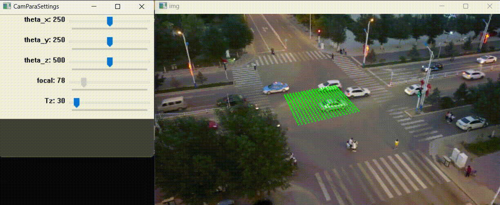

# CamParaEstimator

**Estimate camera parameters from a single image** — an interactive OpenCV tool extracted from [UCMCTrack (AAAI 2024)](https://github.com/corfyi/UCMCTrack).

Given a single image and a starting camera parameter file, you interactively adjust rotation angles, focal length, and camera height using sliders. A ground-plane grid is projected onto the image in real time so you can visually align it with the scene. Press `q` to save and quit.



## Install

```bash
pip install -r requirements.txt
```

## Usage

```bash
python estimate.py --img examples/demo.jpg --cam_para examples/cam_para.txt
```

This opens two windows:
- **img** — your image with a green ground-plane grid projected onto it
- **CamParaSettings** — sliders to adjust parameters
- **Values** — current parameter values in human-readable form

Adjust the sliders until the grid aligns with the ground plane in your image. Press **`q`** to save the updated parameters back to the file.

### Parameters

| Slider | Range | Description |
|--------|-------|-------------|
| theta_x | ±25° | Tilt (pitch) adjustment |
| theta_y | ±25° | Pan (yaw) adjustment |
| theta_z | ±100° | Roll adjustment |
| focal | ±2000 px | Focal length adjustment |
| Tz | ±19 m | Camera height adjustment |

### Camera Parameter File Format

```
RotationMatrices
R00 R01 R02
R10 R11 R12
R20 R21 R22

TranslationVectors
Tx Ty Tz    (in millimeters)

IntrinsicMatrix
fx  0  cx
 0 fy  cy
 0  0   1
```

## Python API

```python
from campara import CameraParaEstimator

est = CameraParaEstimator("image.jpg", "cam_para.txt")
est.run(display_scale=0.5)
```

## Using the Output with UCMCTrack

The saved `.txt` file is directly compatible with UCMCTrack and any tracker using the `Mapper` class:

```python
from campara import Mapper

mapper = Mapper("cam_para.txt", dataset="mot")
xy, sigma = mapper.mapto(detection_box)  # [x1, y1, w, h]
```

## Credits

Originally part of [UCMCTrack](https://github.com/corfyi/UCMCTrack) by Corfyi et al. (AAAI 2024).  
Extracted and packaged as a standalone tool.
